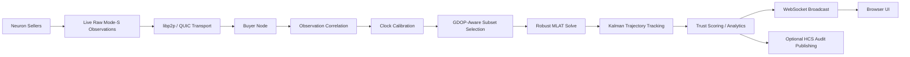

# n-MLAT

`n-MLAT` is a decentralized aircraft localization system that uses multilateration (MLAT) to estimate live aircraft positions from distributed Mode-S observations collected over the Neuron network. Instead of relying on broadcast ADS-B latitude and longitude, the system correlates the same aircraft transmission across multiple geographically distributed receivers, solves the aircraft position from time-difference-of-arrival (TDOA), and renders the result on a live map.

The project was built around the 4DSky MLAT challenge goal: demonstrate that decentralized, peer-to-peer sensor networks can provide resilient, trust-minimized airspace awareness without centralized raw-data collection. `n-MLAT` uses Hedera-backed discovery, Neuron/4DSky peer connectivity, a Go MLAT pipeline, and a browser UI to turn live distributed aviation data into auditable aircraft localization.

## Problem It Solves

Many aircraft either do not broadcast trustworthy position data or do so unreliably. Classical airspace awareness systems often depend on centralized collectors, trusted sensor operators, or cooperative aircraft messages.

`n-MLAT` addresses that by:

- discovering independent seller nodes on the Neuron network
- consuming live raw Mode-S observations directly from peers
- correlating the same transmission across multiple sensors
- solving aircraft position from timing and geometry alone
- exposing trust, uncertainty, geometry, and contributor metadata in the UI
- optionally publishing structured audit output to Hedera Consensus Service (HCS)

## What n-MLAT Does

- Discovers live data sellers via Hedera-backed Neuron / 4DSky flow
- Receives raw Mode-S packets over `libp2p` + `QUIC/UDP`
- Enforces trusted seller geometry using local sensor overrides
- Correlates same-frame observations across multiple sellers
- Performs robust MLAT solving with geometry-aware subset selection
- Learns per-sensor clock correction and pairwise offset relationships
- Tracks aircraft with a Kalman-style trajectory filter
- Scores seller trust and uses trust weighting inside the solver
- Streams live aircraft, geometry, uncertainty, and seller telemetry to a browser map
- Publishes rich MLAT fix metadata and network summaries to Hedera HCS

## Challenge Alignment

This project is designed to satisfy the core challenge requirements:

- **No broadcast aircraft position dependency**
  - Aircraft position is solved from sensor timing and geometry, not ADS-B latitude/longitude.
- **Live decentralized data ingest**
  - The buyer consumes live aviation data from Neuron/4DSky peers.
- **Hedera-based discovery**
  - Seller discovery and network coordination run through the Hedera-linked Neuron stack.
- **Time-correlated multi-sensor fusion**
  - The pipeline groups matching aircraft transmissions across sensors and solves only when sufficient overlap exists.
- **Decentralized, trust-minimized airspace awareness**
  - Seller trust scoring, contributor diagnostics, calibration health, and HCS audit output strengthen the trust-minimized story beyond a naive peer ingest demo.

## System Architecture



### Main Components

- [main.go](/Users/akash/hedera/main.go)
  - Wires the live pipeline together
  - Starts the HTTP/WebSocket server
  - Launches the Neuron SDK buyer
  - Receives seller streams and feeds observations into MLAT
  - Publishes structured HCS audit messages

- [mlat/](/Users/akash/hedera/mlat)
  - `buffer.go`: correlates same aircraft transmissions across sensors
  - `solver.go`: robust MLAT solver with trust weighting and GDOP-aware subset selection
  - `calibration.go`: clock offset/drift learning, pairwise sensor calibration, trust scoring
  - `tracker.go`: Kalman-style trajectory smoothing
  - `locations.go`: trusted seller location overrides
  - `icao.go`: aircraft identity extraction
  - `observation.go`: shared MLAT observation/result types

- [server/](/Users/akash/hedera/server)
  - Serves the map UI and WebSocket feed

- [static/index.html](/Users/akash/hedera/static/index.html)
  - Main demo UI
  - Shows live tracks, waiting groups, geometry, uncertainty, seller status, and analytics

- [hedera-main/publisher.go](/Users/akash/hedera/hedera-main/publisher.go)
  - Structured Hedera HCS publisher for fix events and network summaries

- [frontend/](/Users/akash/hedera/frontend)
  - Optional Next.js 16 frontend prototype
  - Not required for the main HTML demo path

## Core MLAT Pipeline

### 1. Seller Discovery and Connectivity

The buyer uses the Neuron/4DSky SDK and Hedera-backed discovery flow to locate seller nodes and open peer-to-peer streams over `libp2p` and `QUIC`.

### 2. Raw Observation Ingest

Each seller sends:

- sensor ID
- coarse and fine timestamp
- raw Mode-S frame bytes

The buyer maps the seller to trusted sensor coordinates using `location-override.json`.

### 3. Frame Correlation

Observations are grouped by:

- aircraft ICAO
- raw frame identity
- timing window

This ensures MLAT runs on the same transmission seen by multiple receivers, rather than simply mixing packets from the same aircraft.

### 4. Timing Calibration

The system applies a software clock calibration layer:

- per-sensor offset learning
- drift estimation
- jitter tracking
- pairwise sensor offset learning
- reference-aircraft calibration using the tracked aircraft state

This improves distributed timing quality without requiring centralized hardware clock synchronization.

### 5. Geometry-Aware Solve

The solver:

- performs robust non-linear MLAT fitting
- uses seller trust weighting
- rejects outliers
- computes GDOP
- dynamically selects stronger receiver subsets when many sensors are available

### 6. Trajectory Tracking

Solved aircraft positions are passed through a Kalman-style constant-velocity tracker to:

- reduce noise
- stabilize paths
- improve continuity
- provide smoother live trajectories

### 7. UI and Audit Output

The backend broadcasts live updates to the browser UI and optionally publishes richer audit messages to Hedera HCS.

## Trust-Minimized Features

`n-MLAT` is not just a raw MLAT solver. It also includes trust-oriented features:

- **Trusted sensor overrides**
  - Sellers are only used for MLAT if true coordinates are available locally.
- **Seller trust score**
  - Sellers are scored from residual behavior, jitter, and consistency.
- **Trust-weighted solving**
  - Lower-trust sellers are downweighted during MLAT fitting.
- **Contributor diagnostics**
  - Each aircraft fix exposes contributor residuals, clock adjustment, jitter, clock health, seller score, and trust label.
- **Structured HCS audit output**
  - Aircraft fix metadata and network summaries are published in a more explainable, auditable form.

## Key Features

### Aircraft Localization

- MLAT without ADS-B lat/lon
- TDOA-based solving from distributed Mode-S observations
- 4+ sensor solve threshold
- robust outlier rejection
- dynamic subset selection for better geometry

### Time Synchronization

- per-sensor offset correction
- drift estimation
- pairwise sensor offset learning
- tracked-aircraft reference calibration

### Tracking and Quality

- Kalman-style trajectory smoothing
- uncertainty estimation
- GDOP computation
- quality labels
- trust labels

### UI Integrated Features


- live aircraft tracks
- waiting aircraft groups
- selected aircraft geometry view
- contributor sensor markers
- geometry lines from aircraft to contributing sensors
- uncertainty ellipse
- network analytics
- connected seller list
- aircraft quality and trust badges

### Hedera Audit Output

Two audit event types are published:

- `mlat_fix`
  - aircraft position
  - uncertainty
  - GDOP
  - quality
  - trust
  - contributor diagnostics

- `network_summary`
  - connected sellers
  - tracked aircraft
  - total fixes
  - average trust/quality
  - fix rate
  - seller reputation summaries

## Project Layout

```text
.
├── README.md
├── main.go
├── app_state.go
├── mlat/
├── server/
├── static/
├── hedera-main/
├── frontend/
├── .buyer-env.example
├── .seller-env.example
└── location-override.example.json
```

## Requirements

- Go `1.24.10`
- buyer credentials in `.buyer-env`
- trusted seller coordinates in `location-override.json`
- a publicly reachable runtime for `UDP 61336`

If your local network is behind CGNAT, run the buyer on a VPS with a public IPv4 address.

## Configuration

### Buyer Environment

Create `.buyer-env` from your challenge credentials.

### Trusted Sensor Coordinates

The repository intentionally does not track real seller coordinate data.

Use:

```bash
cp location-override.example.json location-override.json
```

Then replace the placeholder entries with:

- seller public key
- trusted latitude
- trusted longitude
- trusted altitude
- optional seller name

## Running the Project

### Local Run

```bash
go run . --port=61336 --mode=peer --buyer-or-seller=buyer --list-of-sellers-source=env --envFile=.buyer-env
```

### Built Binary

```bash
go build -o hedera4d .
./hedera4d --port=61336 --mode=peer --buyer-or-seller=buyer --list-of-sellers-source=env --envFile=.buyer-env
```

### Recommended VPS Run

Use a VPS with:

- public IPv4
- inbound `UDP 61336`
- inbound `TCP 8080` if you want public browser access

The HTML demo UI is served by the Go backend at:

- `http://localhost:8080` locally
- `http://<server-ip>:8080` remotely if exposed

## Testing

Run:

```bash
go test ./...
```

If your environment blocks the default Go cache:

```bash
GOCACHE=/tmp/go-build-cache go test ./...
```

## Current Status

The current implementation includes:

- live decentralized peer ingest
- working MLAT solve pipeline
- timing calibration
- GDOP-aware solve selection
- Kalman-style tracking
- seller trust scoring
- analytical HTML demo UI
- structured Hedera audit output

This means the project has moved beyond a minimal challenge submission and into a strong live prototype with trust, resilience, and observability features.

## Roadmap

Roadmap future work:

- replay mode for safer demos and offline analysis
- long-run resilience testing and automatic recovery
- richer historical seller reputation persistence
- stronger anti-spoofing / authenticated observation layers
- more advanced uncertainty modeling
- hybrid MLAT + learned correction after collecting labeled replay data

## Notes

- The solver does **not** use aircraft-broadcast position coordinates.
- `location-override.json` is intentionally ignored by Git.


## Summary

`n-MLAT` demonstrates that decentralized, peer-to-peer sensor networks can localize aircraft in real time using distributed Mode-S observations while improving resilience and trust minimization through geometry-aware solving, seller trust weighting, online timing calibration, trajectory tracking, and Hedera-auditable outputs.
